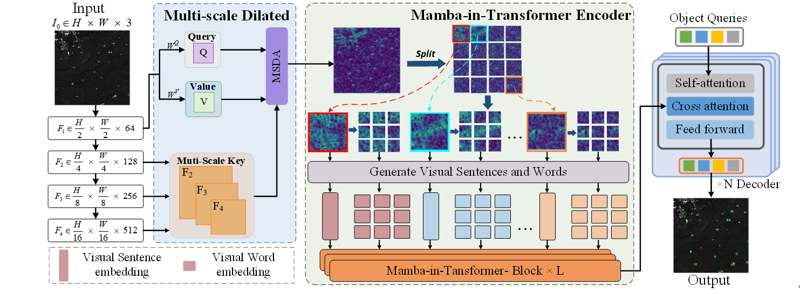

<div align="center">
<h1>MIT-DETR </h1>
<h3>MIT-DETR: Mamba-In-Transformers for Efficient Small Object Detection in SAR Images</h3>
</div>


Based on the **[MMdetection](https://github.com/open-mmlab/mmdetection) 3.1.0** framework, this project modifies its data flow and related classes and functions, and changes the MMdetection to a  detection framework to facilitate **Small Object Detection In SAR Images**.

## **Overview**

<p align="center">
  
</p>


## **Main Results**

**`Dataset: HRSID and LS-SSDD-V1.0`**


## **Getting Started**

### Installation

ref : [mmdetection installation](https://mmdetection.readthedocs.io/en/latest/get_started.html)

**Step 1: Clone the MIT-DETR repository:**

To get started, first clone the MIT-DETR repository and navigate to the project directory:

```bash
git clone https://github.com/CongLi-18/MIT-DETR.git
cd MIT-DETR
```

**Step 2: Environment Setup:**

MIT-DETR recommends setting up a conda environment and installing dependencies via pip. Use the following commands to set up your environment:

***Create and activate a new conda environment***

```bash
conda create -n MIT-DETR
conda activate MIT-DETR
```

***If you develop and run mmdet directly, install it from source***

```
pip install -v -e .
```

***Install Dependencies***

```bash
pip install -r requirements.txt
pip install -r requirements_rgbt.txt
```

## :white_check_mark: Updates
* **` Novermber. 18th, 2024`:** The source code is provided. 

## **Acknowledgment**
